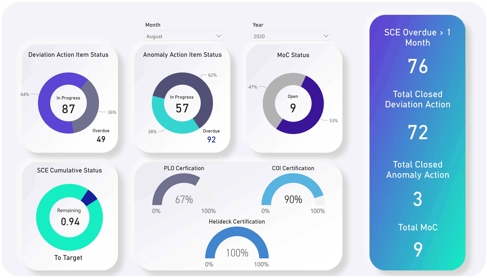
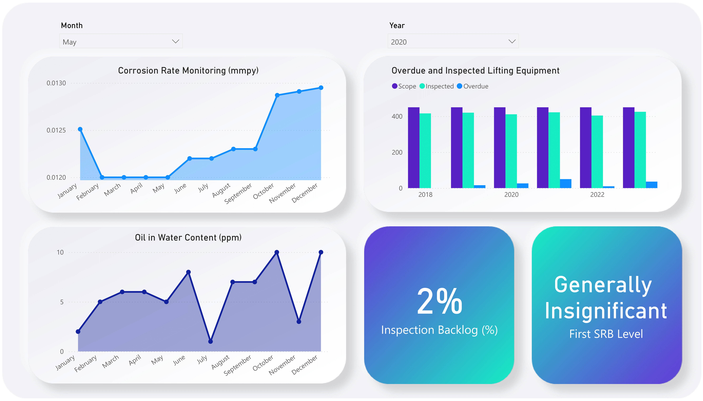

# Corporate Dashboard – Asset Integrity Monitoring (Power BI)

## Overview

This Power BI dashboard project was developed to simulate an **Asset Integrity Dashboard** used within an engineering or operations context—specifically designed to support **business strategy** and **optimization** in a natural gas business unit.

The dashboard demonstrates how data visualization can support proactive decision-making, process automation, and performance tracking across engineering and project execution domains.

---

## Project Objectives

- Visualize and monitor **monthly asset integrity performance**.
- Enable **data-driven decision making** through clear KPIs and trends.
- Simulate a live dashboard using **Power BI's auto-refresh** capabilities (dummy data used).
- Structure the display by **departments or operational areas**.
- Align with best practices in **process optimization**, **compliance**, and **stakeholder reporting**.

---

## Features

- **Deviation, Anomaly, and MoC Status Tracking**
    - Displays number of items in progress, overdue, and closed.
    - Useful for identifying areas needing corrective action.

- **Safety Critical Elements (SCE) Cumulative Status**
    - Progress toward compliance targets.

- **Certifications Overview**
    - PLO, COI, and Helideck Certification visual indicators.
    - Promotes safety compliance awareness.

- **Corrosion & Oil Monitoring**
    - Trends of corrosion rate (mmpy) and oil in water content (ppm) by month.

- **Lifting Equipment Status**
    - Tracks overdue and completed inspections across multiple years.

- **Inspection Backlog Indicator**
    - Real-time percentage of inspections behind schedule.

- **SRB Level Indicator**
    - Summarizes overall asset integrity risk in a clear, business-friendly message.

---

## Technical Details

- **Platform:** Microsoft Power BI
- **Data Source (Simulated):**
    - Microsoft SQL Server
    - SharePoint Lists
    - Dummy data used in this demo version
- **Auto-Refresh:** Simulated daily update schedule
- **Filter Options:** Monthly and yearly slicing capabilities

---

## Use Case Alignment

This project reflects the core tasks outlined in the Engineering Strategy & Business Optimization stream:

✅ **Business Process Improvements** – Provides clarity on where delays and risks occur in asset integrity management.

✅ **Tool Development (Power BI)** – Demonstrates practical use of Power BI for process visibility and stakeholder reporting.

✅ **Data Modeling & Reporting** – Simulates real-world data transformation and visualization logic to support leadership decisions.

✅ **Stakeholder Communication** – Dashboard designed to be consumed by various functional groups, from engineering teams to senior leadership.

---

## Screenshots

### Status Overview & Certifications

### Inspection & Corrosion Trends

---

## Notes

> This dashboard uses simulated/dummy data. In a real deployment, this would be connected to live data sources (SQL Server, SharePoint) and used for active monitoring.

---

